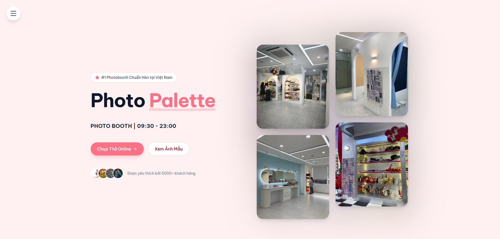

# Photo Palette

## Table of Contents

1.  [Introduction](#1-introduction)
2.  [Technologies Used](#2-technologies-used)
3.  [System Architecture](#3-system-architecture)
4.  [User Interface](#4-user-interface)
5.  [Installation Guide (Local)](#5-installation-and-local-setup)
6.  [User Guide](#6-user-guide)

---

## 1. Introduction

**Photo Palette** is an online **Photobooth Web Application** that brings the Korean-style photo booth experience directly to the browser. Users can take photos, customize frames, and download images instantly without installing any software.

---

## 2. Technologies Used


---

## 3. System Architecture

### Logic Layers

```text
+---------------------+       +---------------------+       +---------------------+
|        VIEW         |       |     LOGIC / BUS     |       |    SERVICE / DAL    |
| (React Components)  | <---> | (Custom Hooks:      | <---> | (Browser APIs:      |
| - HomePage          |       |  usePhotoBooth)     |       |  MediaStream,       |
| - PhotoBooth        |       | - State Management  |       |  Canvas, LocalFile) |
| - Gallery           |       | - Step Control      |       |                     |
+---------------------+       +---------------------+       +---------------------+
```text

### Architecture Model

```text
+-----------------------+           +-----------------------+
|      HomePage         | <-------> |      PhotoBooth       |
|     (Main UI)         |           |    (Core Feature)     |
+-----------------------+           +-----------------------+
          |                                     |
          | Navigation                          | Uses Hook
          v                                     v
+-----------------------+           +-----------------------+
|    React Router       |           |     usePhotoBooth     |
|     (Navigation)      |           |  (Logic & State Mgr)  |
+-----------------------+           +-----------------------+
                                                |
                                                | Call API
                                                v
                                    +-----------------------+
                                    |    Browser APIs       |
                                    |  (Webcam & Canvas)    |
                                    +-----------------------+
```

### Photobooth Flow

```text
    [ USER ]                             [ SYSTEM / APP ]
      |                                         |
      | (1) Click "Try Now"                     |
      |---------------------------------------->|
      |                                         |
      |        (2) Choose Layout & Theme        |
      |<----------------------------------------|
      |                                         |
      | (3) Confirm & Grant Camera Access       |
      |---------------------------------------->|
      |                                         |---- [ Start Webcam ]
      |                                         |           |
      |        (4) Show Live View               |<----------|
      |<----------------------------------------|
      |                                         |
  [ CAPTURE PROCESS ]                           |
      |                                         |
      | <------ (5) Countdown 3-2-1 ------------|
      |                                         |
      |        (6) Flash & Capture              |
      |<----------------------------------------|
      |                                         (Repeat for number of photos)
      |                                         |
  [ IMAGE PROCESSING ]                          |
      |                                         |---- [ Merge via Canvas ]
      |                                         |           |
      |        (7) Display Result               |<----------|
      |<----------------------------------------|
      |                                         |
      | (8) Download / Retake                   |
      |---------------------------------------->|
      |                                         |
```

---

## 4. User Interface

_The homepage features a modern design focused on user experience with smooth interactive effects._



---

## 5. Installation (Local)

To run this project locally, you need to install Node.js (version 16 or higher).

### Step 1: Clone the repository

Open your terminal and run:

```bash
git clone https://github.com/KaitoDeus/photobooth-palette.git
cd photobooth-palette
```

### Step 2: Install dependencies

```bash
npm install
```

### Step 3: Run the application

```bash
npm run dev
```

Open your browser and go to http://localhost:5173 to use the app.

---

## 6. User Guide

1.  **Choose Layout**: Select your preferred layout (Strip 1x4, Grid 2x2, etc.).
2.  **Select Frame**: Pick a frame style (Cool, Cute, Basic...).
3.  **Take Photos**:
    - Grant camera access.
    - Pose according to the countdown (3 seconds per shot).
    - Optionally enable Recap (top-left) to record the session.
4.  **Get Results**:
    - View the final merged image.
    - Download the photo or watch the recap video (if enabled).
